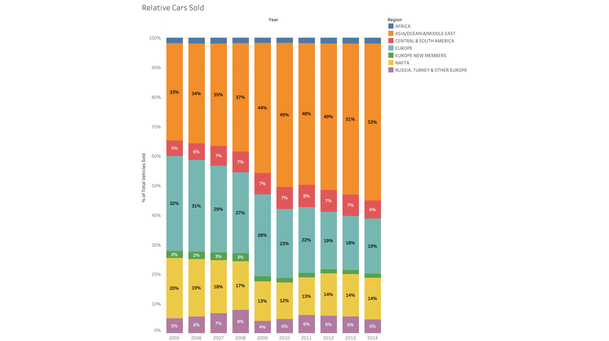

_SuperDataScience-Tableau-2018 course | jukka.kansanaho@gmail.com | 2019-010-07_

# SuperDataScience-Tableau-2018

This course is the first course in SuperDataScience's Business Intelligence (BI) Analyst Learning path (https://www.superdatascience.com/paths).

The courses on this path are:
* Tableau 2018
* Power BI A-Z
* Tableau 2018 Advanced
* Tableau Expert
* Tableau for Business Analytics and Marketing

Tableau 2018 course page: https://www.superdatascience.com/courses/tableau-2018-hands-on-tableau-training-for-data-science/

# Vizualisations
Here are Tableau visualizations from this course.

## Module-1: Getting Started

*Super Stores US*

## Module-2: Tableau Basics - First Bar Chart

*Office Supplies - Annual Bonus Analysis*

## Module-3: Time Series, Aggregation, and Filters

*US Long Term Unemployment*

## Module-4: Maps, Scatter Plots, and First Dashboard

*Amazing Mart EU*

## Module-5: Joining and Blending Data + Dual Axis Charts

*Amazing Mart EU: Sales vs Targets per Department*

## Module-6: Table Calculations, Advanced Dashboards, Storytelling

*UK Bank Customers - Dashboard All*

*UK Bank Customers - Dashboard Wales*

## Module-7: Advanced data

*Personal Vehicle Sales Global - Relative Cars Sold*

*Personal Vehicle Sales Global - Map*

## Module-8: Clusters, Custom Territories, Design Features

*Startup Expansion - Dashboard*

## Module-9: What's New in Tableau 2018

*AVG Annual Salary - Map*

*New York City Parks - Map with Crime Rates*
